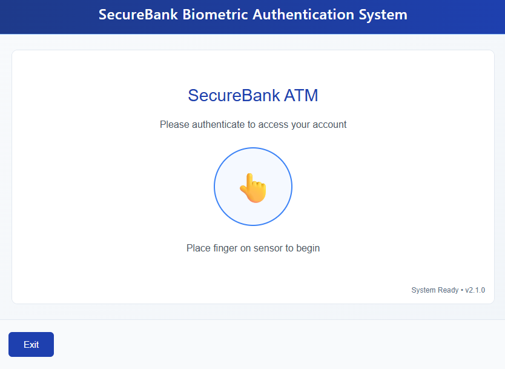
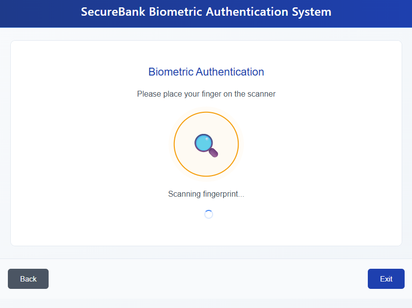
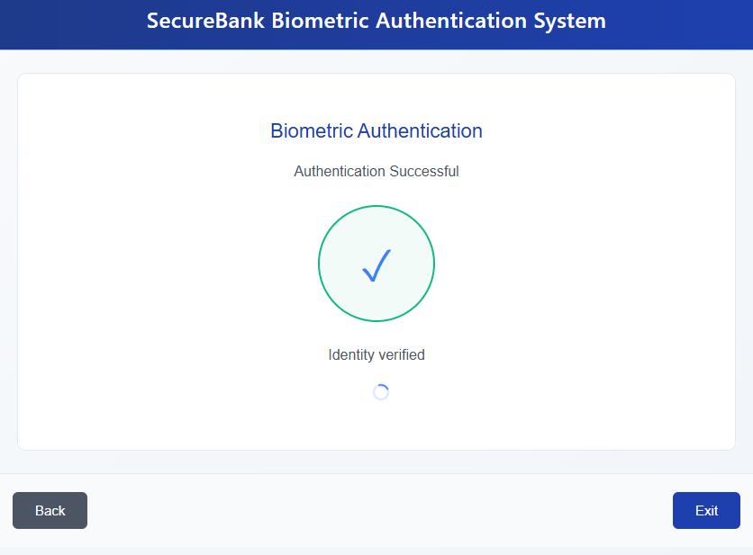
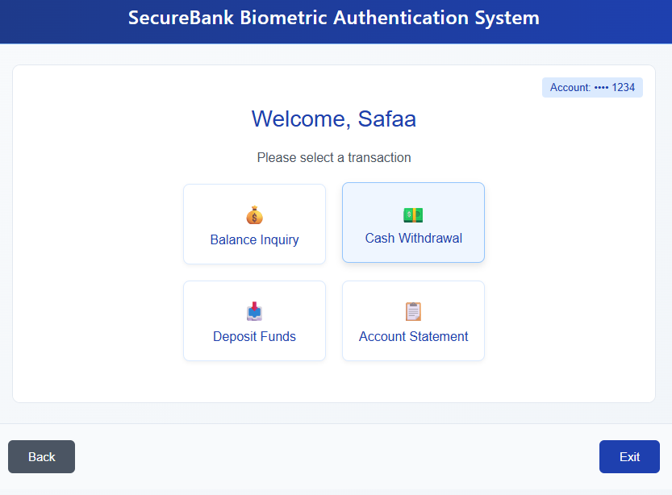

# Fingerprint-Based ATM System

## Contents
- [Overview](#overview)
- [Features](#features)
- [Requirements](#requirements)
- [System Architecture](#system-architecture)
- [Implementation Steps](#implementation-steps)
- [Main Parts of Code](#main-parts-of-code)
  - [Fingerprint Authentication](#fingerprint-authentication)
  - [Database Management](#database-management)
  - [ATM Transactions](#atm-transactions)
  - [Integration](#integration)

---

## Overview
The Fingerprint-Based ATM System replaces traditional PIN-based ATM authentication with fingerprint biometrics for enhanced security. Users authenticate themselves using their fingerprint to perform transactions such as withdrawals, deposits, and balance inquiries.

---

## Features
1. **Secure Authentication**: Uses biometric fingerprint scanning for identity verification.
2. **User-Friendly Interface**: Intuitive system for easy transactions.
3. **Database Integration**: Securely stores user details and transaction history.
4. **Real-Time Transactions**: Instant updates to account balances.
5. **Enhanced Security**: Eliminates the risk of PIN theft or forgetting passwords.

---

## Requirements
### Hardware
- Fingerprint Scanner (e.g., R305, ZFM-20, or any compatible module)
- Raspberry Pi/Arduino (for edge computing) or PC
- ATM-style keypad and screen
- Cash dispenser (optional for full ATM simulation)

### Software
- Python (Backend)
- SQLite/MySQL (Database)
- Flask or Django (for API/Interface)
- PyFingerprint Library (for fingerprint scanner integration)

### Libraries and Dependencies
- `pyfingerprint`
- `flask` or `django`
- `sqlite3` or `mysql-connector`
- `tkinter` (for GUI)
- `RPi.GPIO` (if using Raspberry Pi for hardware integration)

---

## System Architecture
1. **Fingerprint Scanner**: Captures and verifies fingerprints.
2. **Backend System**: Manages user authentication, transactions, and database operations.
3. **Database**: Stores user details such as fingerprint data (encrypted), account information, and transaction history.
4. **GUI/API**: Provides an interface for users to interact with the system.

---

## Implementation Steps
### Step 1: Fingerprint Enrollment
- Users register their fingerprint during account setup.
- The system saves a hashed version of the fingerprint data in the database.

### Step 2: Fingerprint Authentication
- The user places their finger on the scanner during login.
- The system matches the scanned fingerprint with the stored data.

### Step 3: Transaction Handling
- After successful authentication:
  - Display account options (e.g., balance inquiry, withdrawal, deposit).
  - Process the transaction and update the database.

### Step 4: Database Management
- Maintain separate tables for users, accounts, and transaction history.
- Use encryption for sensitive data.

### Step 5: Hardware Integration
- Connect the fingerprint scanner, keypad, and display to the system.
- Use GPIO or serial communication for hardware interaction.

---

## Main Parts of Code

### 1. Fingerprint Authentication
```
from pyfingerprint.pyfingerprint import PyFingerprint

def enroll_fingerprint():
    try:
        f = PyFingerprint('/dev/ttyUSB0', 57600, 0xFFFFFFFF, 0x00000000)

        if f.verifyPassword():
            print("Place your finger on the scanner...")
            while not f.readImage():
                pass
            
            f.convertImage(0x01)
            position = f.storeTemplate()
            print(f"Fingerprint enrolled successfully at position {position}")
            return position
        else:
            print("Failed to connect to fingerprint scanner.")
    except Exception as e:
        print(f"Error: {e}")

def authenticate_fingerprint():
    try:
        f = PyFingerprint('/dev/ttyUSB0', 57600, 0xFFFFFFFF, 0x00000000)

        if f.verifyPassword():
            print("Place your finger on the scanner...")
            while not f.readImage():
                pass
            
            f.convertImage(0x01)
            position = f.searchTemplate()
            
            if position[0] >= 0:
                print("Authentication successful!")
                return True
            else:
                print("Authentication failed.")
                return False
    except Exception as e:
        print(f"Error: {e}")
```

### 2. Database Management
```
import sqlite3

def initialize_database():
    conn = sqlite3.connect('atm_system.db')
    cursor = conn.cursor()
    cursor.execute("""
        CREATE TABLE IF NOT EXISTS users (
            id INTEGER PRIMARY KEY AUTOINCREMENT,
            name TEXT NOT NULL,
            fingerprint_template BLOB NOT NULL,
            balance REAL DEFAULT 0.0
        )
    """)
    cursor.execute("""
        CREATE TABLE IF NOT EXISTS transactions (
            id INTEGER PRIMARY KEY AUTOINCREMENT,
            user_id INTEGER,
            type TEXT,
            amount REAL,
            date TIMESTAMP DEFAULT CURRENT_TIMESTAMP,
            FOREIGN KEY(user_id) REFERENCES users(id)
        )
    """)
    conn.commit()
    conn.close()

def add_user(name, fingerprint_template, initial_balance):
    conn = sqlite3.connect('atm_system.db')
    cursor = conn.cursor()
    cursor.execute("""
        INSERT INTO users (name, fingerprint_template, balance)
        VALUES (?, ?, ?)
    """, (name, fingerprint_template, initial_balance))
    conn.commit()
    conn.close()

```

### 3. ATM Transactions
```
def check_balance(user_id):
    conn = sqlite3.connect('atm_system.db')
    cursor = conn.cursor()
    cursor.execute("SELECT balance FROM users WHERE id = ?", (user_id,))
    balance = cursor.fetchone()[0]
    conn.close()
    return balance

def update_balance(user_id, amount, transaction_type):
    conn = sqlite3.connect('atm_system.db')
    cursor = conn.cursor()

    # Update balance
    cursor.execute("""
        UPDATE users SET balance = balance + ? WHERE id = ?
    """, (amount if transaction_type == 'deposit' else -amount, user_id))

    # Record transaction
    cursor.execute("""
        INSERT INTO transactions (user_id, type, amount) VALUES (?, ?, ?)
    """, (user_id, transaction_type, amount))
    conn.commit()
    conn.close()
```

### 4. Integration
```
from flask import Flask, request, jsonify

app = Flask(__name__)

@app.route('/authenticate', methods=['POST'])
def authenticate():
    if authenticate_fingerprint():
        return jsonify({"status": "success", "message": "Authentication successful."})
    else:
        return jsonify({"status": "fail", "message": "Authentication failed."})

@app.route('/balance', methods=['GET'])
def balance():
    user_id = request.args.get('user_id')
    balance = check_balance(user_id)
    return jsonify({"user_id": user_id, "balance": balance})

@app.route('/transaction', methods=['POST'])
def transaction():
    data = request.json
    user_id = data['user_id']
    amount = data['amount']
    transaction_type = data['type']
    update_balance(user_id, amount, transaction_type)
    return jsonify({"status": "success", "message": f"{transaction_type.capitalize()} completed."})

if __name__ == '__main__':
    initialize_database()
    app.run(debug=True)

```

## Interfaces 










